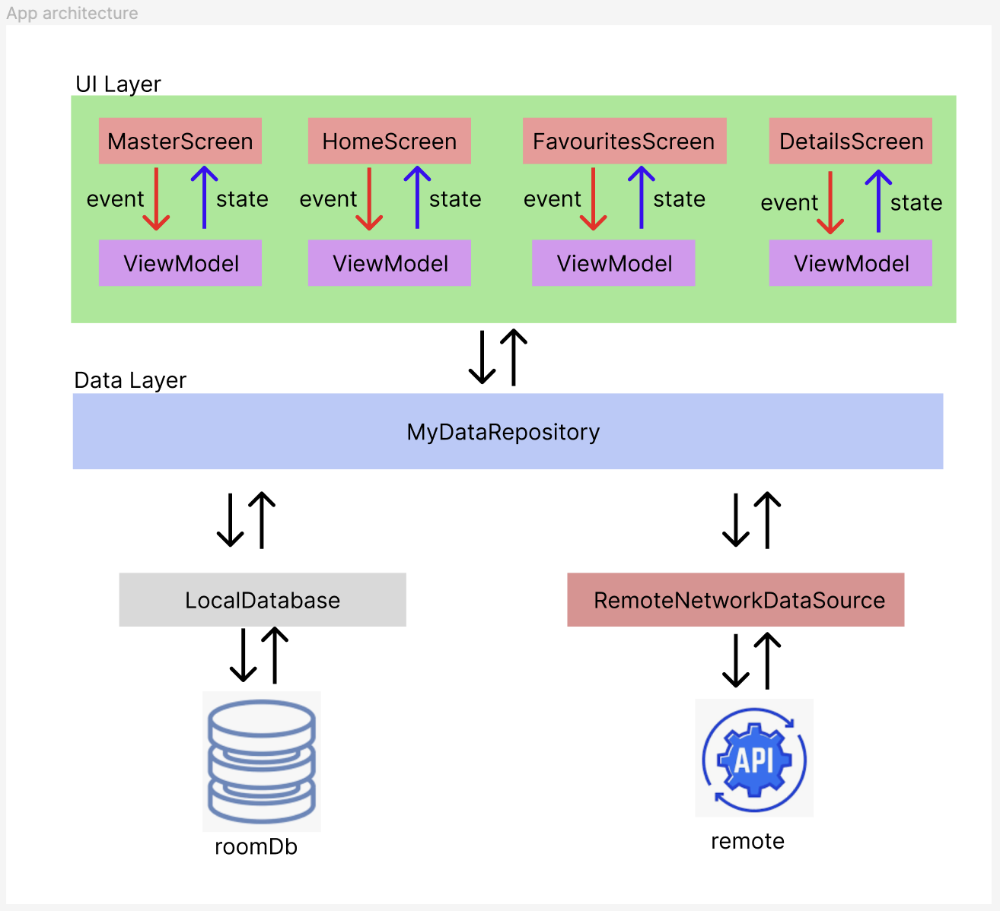

# With-Android-Coding-Test

# 1. アプリのイントロダクション
## 1.1 機能一覧
ご展開いただいたで、下記のような機能を追加いたしました。
* 全画像を閲覧する
* お気に入りする機能
* それぞれの画像の詳細表示
## 1.2 画面遷移

# 2. アプリアーキテクチャ
## 2.1 アプリの構成
基本的に、今回のアプリは、二つのレイヤから組み込まれます。
* UIレイヤ
  * 画面(compose関数): UIを実装する
  * ViewModel:各画面に対して、画面の状態を管理するViewModelクラスとなります。
  * 画面一覧
    * MasterScreen: トップバーおよびナビゲーションバーを持つ画面、またアプリナビゲーションをホストする画面
    * HomeScreen: 画像一覧を表示する画面
    * FavouritesScreen:お気に入り一覧を表示する画面
    * DetailsScreen:各Userの詳細画面
* Dataレイヤ
  * repository: UIレイヤからみられるデータ集約ポイントとして動いています。
  * LocalDatabase: APIやりとりの頻度を控えるために、ローカルCacheとして動いています。また、Single Source of Truthとして設計されおり、常に、UIに表示するデータは、このデータベースからとなります。
  * RemoteNetworkDataSource:Api連携するモジュールとなります。 

## 2.2 データモデル方針
基本の方針は、各データブロックを分離できるように、それぞれに対して、データモデル化されおります。
* リモートデータ及びローカルデータのschemeの変更に影響されないように、repositoryで自分のデータ構成を定義します。
* ローカルデータ構成及びリモートデータは、それぞれ分別されます。
# 3. 依存関係インジェクションとAPI連携
* Hiltを活用して、依存関係インジェクションを実現されます。
* Retrofit2を使ってAPI連携実装されます。
# 4. テスト
## 4.1 テスト方針
テストの項目は、下記となります。
* ローカルテスト: 開発環境のマシンで実施できる項目
  * ViewModelテスト
  * Repositoryテスト
* Instrumentedテスト: Androidフレームワークのクラスなどが必要なケース。エミュレータまたは、実機が必要
  * UIテスト
  * アプリナビゲーションテスト
## 4.2 テストソース
* ローカルテスト: app/src/testに格納されます
* Instrumentedテスト: app/src/androidTestに格納されます。
# 5. 環境情報
AndroidStudioのバージュン及びローカルマシンの差異で、ビルドできないこともあります。
今回、利用環境情報は、下記となります。ビルドできない場合は、ご参照いただけばと思います。
* Android Studio Hedgehog | 2023.1.1
* MacOS　Sonoma 14.4.1

# 6. [Android アーキテクチャに関する推奨事項](https://developer.android.com/topic/architecture/recommendations?hl=ja#compose)の実装項目

| No |カテゴリー | 項目目 | 詳細説明 | 推奨度 |
|----|---------| ------|-------|------------|
| 1  | 階層型アーキテクチャ|明確に定義されたデータレイヤを使用します | リポジトリは、データソースを集約するレイヤとして適用する| 強く推奨|
| 2 | 階層型アーキテクチャ|明確に定義された UI レイヤを使用します| 今回、小さいアプリなので、uiパッケージに配置されます。| 強く推奨|
| 3 | 階層型アーキテクチャ|データレイヤでは、リポジトリを使用してアプリケーション データを公開する必要があります。| １番と同様 | 強く推奨|
| 4 | 階層型アーキテクチャ|コルーチンと Flow を使用します。| coroutinesは、非同期制御及び処理時間が長いデータベース操作などで、UI描画へ影響しないように、利用されます。主に、Viewmodelとdataレイヤのところに利用されます。  Flowは、UIがデータ及び状態に監視するため、利用されます。過去のLiveDataの代わり手段となります。| 強く推奨|
| 5 | UI レイヤ|単方向データフロー（UDF）に従います。| 全ての画面は、ViewModelが公開する状態をオブザーすることとなります。| 強く推奨|
| 6 | UI レイヤ|メリットをアプリに適用できる場合は、AAC ViewModel を使用します。|Compose UI更新及びアプリロジックは、viewModelからアクセスとなります。| 強く推奨|
| 7 | UI レイヤ|ライフサイクル対応 UI 状態コレクションを使用します。| 今回、Composeを利用しますので、flowを収集することがlifeCycleと紐つけるように、collectAsStateWithLifecycleが必要となります。| 強く推奨|
| 8 | UI レイヤ|ViewModel から UI にイベントを送信しないようにします。| 全てのイベントは、viewModelで処理で、結果は、UIへ反映することです。| 強く推奨|
| 9 | UI レイヤ|単一アクティビティのアプリケーションを使用します。| 本アプリは、コントロールフローを統一するため、単一アクティビティです。| 推奨|
| 10 | UI レイヤ|Jetpack Compose を使用します。|適用されます。| 推奨|
| 11 | ViewModel|ViewModel が、Android のライフサイクルに依存しないようにします。| ViewModelは、Androidリソースなどを依存関係持たせないことで、ローカルテスト可能となります。| 強く推奨|
| 12 | ViewModel|コルーチンと Flow を使用します。| オブサーバーパータンを実装するので、Flow利用されます、またsuspend関数実装する際に、coroutinesを利用します。| 強く推奨|
| 13 | ViewModel|画面レベルで ViewModel を使用します。|各画面に対して、viewModelを実装されます。| 強く推奨|
| 14| ViewModel| AndroidViewModel を使用しないようにします。| Androidコンテキストを漏れないように、AndroidViewModelを利用しない。| 推奨|
| 15 | ViewModel|UI 状態を公開します。| UI状態は、StateFlowを使って、viewModelから公開されます。 |  推奨|
| 16 | 依存関係を処理する|依存関係挿入を使用します。| Hiltを活用されます。| 強く推奨|
| 17 | 依存関係を処理する|必要に応じてコンポーネントにスコープを設定します。| database、repository、networkを独立して、テストできるように、モジュールを分けられます。| 強く推奨|
| 18 | 依存関係を処理する|Hilt を使用します。| 適用されます。|推奨|
| 19| テスト|テストする内容を把握する。| テスト内容が明確されます。|強く推奨|
| 20 | テスト|モックよりもフェイクを優先します。| テストモジュールを注目できるように、周りのデータをフェイク化されたものを活用します。例えば、repositoryをテストする場合、localDbとnetworksourceはフェイク化の物を利用可能となります。また、UIテストする際に、repositoryをフェイク化される物をおすすめです。| 強く推奨|
| 21 | テスト|StateFlow をテストします。| WhileSubscribedを利用するViewModelあるので、空のコレクターがないと、flow収集できないことです。例えば、DetailsScreenViewModelTest| 強く推奨| 
| 22 | モデル|複雑なアプリではレイヤごとにモデルを作成します。|データモデル化の方針と同様です。|推奨|

# 7. 見送り
現在、Instrumentedテストでは、JUnit５まだ未サポートされているため、主にJUnit4上で実装されている。
JUnit5が正式的にサポートされたら、また移行する予定です。